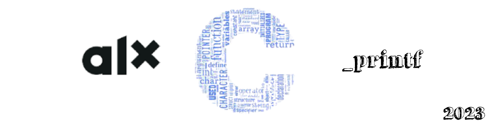

# _printf




## Overview ##

One of the most common but crucial function in the C programmers life is a printf() function. We frequently and often use it to print out an output or return a value to a screen or terminal. But, what is printf()? How does it work?  
In this project we will dive in deeper and we will try to understand what it is and its functionality by building our own printf() function. 
 
### So first, what is Printf()? ###

Printf is a C library function that sends formatted output to standard output(stdout). It's declaration is:- 

```int printf(const char *format, …)```

A printf() function has a return value of integer which is the number of characters printed, excluding the null byte used to end output to strings. 

In its simplest form, it accepts one argument. In this case, the `format` parameter will be the string that contains the text to be written to `stdout`. For instance, in our very first "hello world" C program as shown below, printf contains one parameter which contains a string, Hello, World!. 

```
Include <stdio.h>
/**
*main - a function to print out a string
* Return: 0 Always //int
*/
Int main(void)
{
printf(“Hello, World!\n”);
return (0);
}
```
However, it optionally can also contain embedded format tags that are replaced by the values specified in subsequent additional arguments and formatted as requested.

For example:- 
…
	```printf(“My name is %s\n”, name);``` 
…
Here, printf() takes two arguments. A first argument that is a string inside the double quote and a second argument which is string variable called `name`. How this work is, Printf() starts printing from the first character and go to the next and so on. When it reaches to a percentile or modulo (%) sign which is a format specifier, it will know that it has to print the next character according to the format specified. Therefore, it first will go to the next argument and check the variable storing the format specifier and print out its value, character by character, according to the format specified. In this case, a string (%s) value from a variable called “name”. 

Beside sting `s`, there are number of format specifiers. For instance `i` or `d` for signed decimal and `f` for float as shown in the following table. 

| Specifiers  | Their Output |
|:------------  |:----------------|
|%c	        | A single Character      |
|%d or %i	        | signed decimal integer |
|%e                 | an exponential floating-point number |
|%f                 | a floating-point number |
|%g                 | a general-format floating-point number |
|%o                 | number in octal (base 8) |
|%u                 | Unsigned decimal integer |
|%x                 | Unsigned hexadecimal integer |
|%X                 | Unsigned hexadecimal integer (capital letters)|
|%%                 | a percent sign |

Table 1.1 Partial List of Specifiers and their output.

In this project,  task 0, 1, 2 and 3 shows us how each conversion specifiers are handled by printf(). 

Other Format tags prototypes of printf() are [flags][width][.precision] and [length].

### Flags ###

### Width ###

### precision ###

### length ###

## Mandatory Tasks ##
***
0. I'm not going anywhere. You can print that wherever you want to. I'm here and I'm a Spur for life - Write a function that produces output according to a format.
    * Returns: the number of characters printed (excluding the null byte used to end output to strings)
    * write output to stdout, the standard output stream
    * `format` is a character string. The format string is composed of zero or more directives. 
    * You need to handle the following conversion specifiers:
        * `c`
        * `s`
        * `%`
1. Education is when you read the fine print. Experience is what you get if you don't. Handle the following conversion specifiers:
    * `d`
    * `i`
## Advanced Tasks ##
***
2. With a face like mine, I do better in print - Handle the following custom conversion specifiers:
    * `b`: the unsigned int argument is converted to binary
3. What one has not experienced, one will never understand in print - Handle the following conversion specifiers
    * `u`
    * `o`
    * `x`
    * `X`
4. Nothing in fine print is ever good news - Use a local buffer of 1024 chars in order to call `write` as little as possible.
5. My weakness is wearing too much leopard print - Handle the following custom conversion specifier:
    * `S` : prints the string.
    * Non printable characters (0 < ASCII value < 32 or >= 127) are printed this way: `\x`, followed by the ASCII code value in hexadecimal (upper case - always 2 characters)
6. How is the world ruled and led to war? Diplomats lie to journalists and believe these lies when they see them in print - Handle the following conversion specifier: `p`.
7. The big print gives and the small print takes away - Handle the following flag characters for non-custom conversion specifiers:
    * `+`
    * `space`
    * `#`
8. Sarcasm is lost in print - Handle the following length modifiers for non-custom conversion specifiers:
    * `l`
    * `h`
* Conversion specifiers to handle: `d`, `i`, `u`, `o`, `x`, `X`
9. Print some money and give it to us for the rain forests - Handle the field width for non-custom conversion specifiers.
10. The negative is the equivalent of the composer's score, and the print the performance
    * Handle the precision for non-custom conversion specifiers.
11. It's depressing when you're still around and your albums are out of print
    * Handle the `0` flag character for non-custom conversion specifiers.
12.  Every time that I wanted to give up, if I saw an interesting textile, print what ever, suddenly I would see a collection
    * Handle the `-` flag character for non-custom conversion specifiers.
13. Print is the sharpest and the strongest weapon of our party
    * Handle the following custom conversion specifier:
      * `r` : prints the reversed string
14. The flood of print has turned reading into a process of gulping rather than savoring
    * Handle the following custom conversion specifier:
      * `R`: prints the rot13'ed string
15. *
    * All the above options work well together.

***
### contributors
<a href="https://github.com/MelakuDemeke/printf/graphs/contributors">
  
</a>